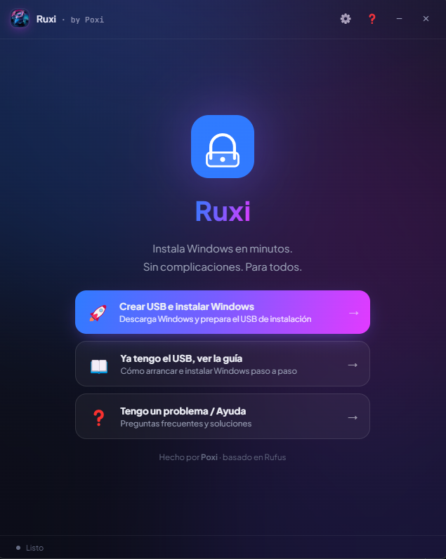
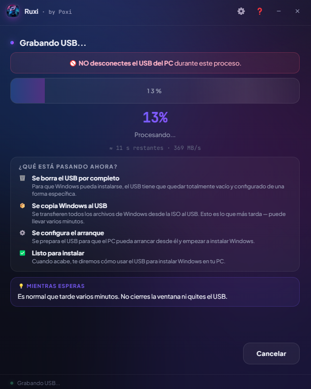
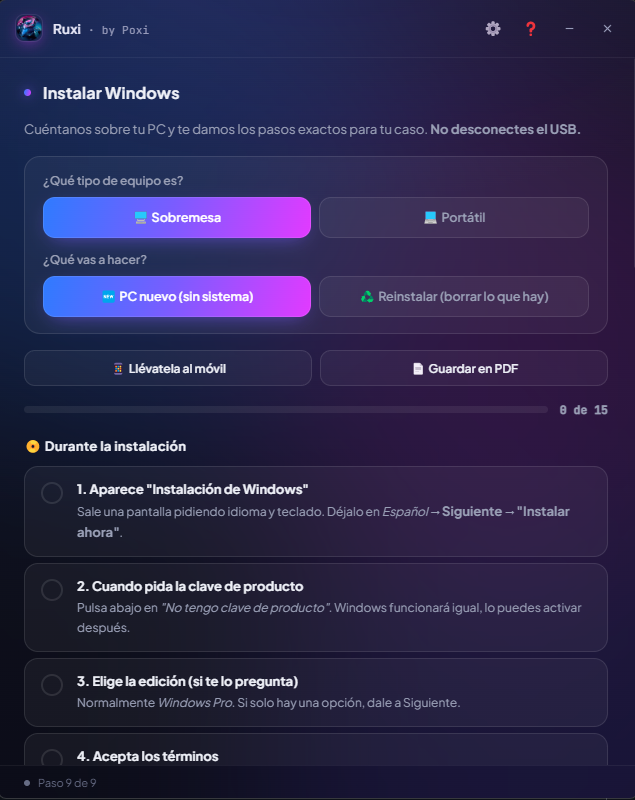

<div align="center">


# ✨ Ruxi

### La forma más sencilla de instalar Windows 🪟

**Sin tecnicismos. Sin pasos raros. Sin pagar a nadie.**
Solo tú, un USB y unos minutos. 🚀

<br>

[](https://github.com/PoxiiTV/Ruxi-Custom-Rufus/releases)
[](https://www.virustotal.com/gui/file/0f326839ce39707f178ad01b0754b1cc409ecc11902682e1a3f8890e69dc0f9a)
[](LICENSE.txt)
[](https://github.com/PoxiiTV)

**🇪🇸 Español** · [🇬🇧 English](#-ruxi--english)

</div>

<br>

---

## 💡 ¿Por qué existe Ruxi?

Instalar Windows **no es difícil** — solo lo parece. 😮‍💨

Mucha gente acaba llevando el ordenador a una tienda y pagando por algo que, con la guía adecuada, podría hacer perfectamente en casa en media hora. Particiones, BIOS, "arrancar desde USB", TPM, Secure Boot… palabras que asustan, pero que en realidad esconden un proceso bastante simple.

**Ruxi existe para que cualquiera pueda hacerlo solo.** 🙌

Tanto si te acabas de montar un PC nuevo, como si quieres dejar tu portátil como recién salido de fábrica, Ruxi te coge de la mano desde el minuto cero: te ayuda a descargar Windows, prepara el USB automáticamente y te explica **paso a paso, en lenguaje normal**, qué hacer hasta que tengas Windows funcionando.

> 🎯 **El objetivo:** que sepas hacerlo tú, entiendas lo que estás haciendo, y no dependas (ni pagues) a nadie para algo que está a tu alcance.

---

## 🪄 ¿Qué es exactamente?

Ruxi es un fork de [**Rufus**](https://github.com/pbatard/rufus) — la herramienta más fiable del mundo para crear USBs de arranque — pero con:

- 🎨 Una **interfaz nueva y bonita** (glassmorphism oscuro)
- 🧭 Un **asistente guiado** que decide la parte técnica por ti
- 📚 Un **tutorial integrado** que no te suelta hasta tener Windows instalado

> 👵 **Pensado para todos:** si tu abuela sabe usar WhatsApp, sabe usar Ruxi.

### 🆚 Ruxi vs. Rufus original

| | 🔧 Rufus | ✨ Ruxi |
|---|:---:|:---:|
| **Interfaz** | Clásica Win32 | Glassmorphism moderno |
| **Dificultad** | Técnica (GPT, UEFI, NTFS…) | Todo automático |
| **Tutorial** | ❌ | ✅ Integrado paso a paso |
| **Descarga de ISO** | ❌ | ✅ Desde la propia app |
| **ISO recomendada** | ❌ | ✅ Windows 11 LTSC optimizado |
| **Guía post-instalación** | ❌ | ✅ Drivers, WiFi, updates |
| **Motor de grabado** | Rufus | Rufus (por debajo) |

---

## 🌟 Características

### 🧭 Fácil de principio a fin
- **Asistente guiado** — 9 pantallas que te llevan de la mano, con pantalla inicial *"¿Qué quieres hacer?"*
- **Descarga de ISOs integrada** — Baja Windows desde la propia app, con barra de progreso, MB y velocidad
- 🔗 **Pega tu propia URL** — ¿Tienes el enlace directo a otra ISO? Pégalo y se descarga
- ⏸️ **Descargas reanudables** — Si se corta la descarga de nuestras ISOs, continúa desde donde se quedó
- ⭐ **ISO recomendada** — Windows 11 IoT LTSC 2024 optimizado por Poxi: sin bloatware, sin telemetría, máximo rendimiento para gaming
- **Todo automático** — GPT + UEFI + NTFS + bypass de TPM/SecureBoot/RAM configurados solos
- 🙅 **Cuenta local** — Sin obligarte a usar cuenta de Microsoft
- 🔐 **Pide administrador automáticamente** al abrirse (no hay que hacer "ejecutar como admin")
- 🏷️ **USB con nombre propio** — Se crea como `Poxi-WINDOWS`
- 🔁 **Crear otro USB** al terminar, sin reiniciar el asistente

### 🛡️ Seguro (no la lías)
- **Verifica qué hay en el USB** antes de borrarlo (te enseña sus archivos y avisa)
- **Comprueba que la ISO es válida** (lee la imagen antes de grabar)
- **Bloquea el disco del sistema** — imposible borrar por error el disco donde tienes Windows
- ☕ **Evita que el PC se suspenda** durante el grabado
- 🔔 **Notificación + sonido** al terminar (aunque esté minimizado)
- ⏱️ **Tiempo restante y velocidad** (MB/s) en tiempo real

### 📚 Tutoriales para todo
- ⌨️ **Guía de arranque** — Tabla de teclas por marca (ASUS, MSI, HP, Lenovo, Dell…) y solución al "Secure Boot Violation"
- 💻 **Detecta tu PC** y resalta automáticamente tu tecla de arranque
- ✅ **Guía de instalación adaptativa** — Pasos marcables que cambian según tu equipo (🖥️ sobremesa / 💻 portátil) y tu caso (🆕 PC nuevo / ♻️ reinstalar)
- 🚀 **Guía post-instalación** — Internet, Windows Update y drivers del fabricante (WiFi/touchpad en portátiles, GPU/chipset en sobremesa)
- 📦 **Instalador de programas básicos** — Chrome + VLC + WinRAR de un clic con Ninite, o **crea el tuyo** eligiendo de una lista (beta)
- 🔑 **Activación de Windows** (avanzado) — Atajo a MAS (Microsoft Activation Scripts), claramente marcado para usuarios avanzados
- 📱 **Llévate la guía al móvil** con un código QR · 📄 o **expórtala a PDF**
- ❓ **FAQ integrada** con los problemas más comunes y sus soluciones

### ✨ Detalles
- ⚙️ **Ajustes** — Un panel para idioma y tema (y futuros ajustes)
- 🌍 **Multi-idioma** — Español e Inglés, se elige al abrir y se cambia cuando quieras
- 🎨 **Temas de color** — 6 paletas (Poxi, Aurora, Sunset, Océano, Ruby, Lima)
- 🔊 **Silenciar sonidos** desde Ajustes
- ℹ️ **Acerca de** — versión, buscar actualizaciones, enlaces y VirusTotal
- 🎉 **Confeti y animaciones** al terminar
- 🆙 **Auto-actualización** (versión instalador) y **aviso + novedades** (changelog) desde GitHub

---

## 📸 Capturas

<div align="center">





<sub>Inicio · Grabando el USB · Guía de instalación paso a paso</sub>

</div>

---

## 📥 Descarga

<div align="center">

### 👉 **[Descargar la última versión](https://github.com/PoxiiTV/Ruxi-Custom-Rufus/releases)** 👈

🌐 **Web del proyecto:** [poxiitv.github.io/Ruxi-Custom-Rufus](https://poxiitv.github.io/Ruxi-Custom-Rufus/)

🛡️ **100% limpio** — [✓ Análisis en VirusTotal (v1.3.0)](https://www.virustotal.com/gui/file/0f326839ce39707f178ad01b0754b1cc409ecc11902682e1a3f8890e69dc0f9a)

</div>

Tienes dos opciones en la última release:
- 🟣 **`Ruxi-Portable.exe`** — no se instala, doble clic y listo
- 🔵 **`Ruxi-Setup-x.x.x.exe`** — instalador con accesos directos (escritorio y menú inicio)

Cualquiera de las dos sirve. ✨

> 🖥️ Requiere **Windows 10/11 (64 bits)**. Te pedirá permisos de administrador al abrirlo (es normal y necesario para grabar el USB).

---

## 🪟 ¿Qué Windows instalo?

Dentro de la app puedes descargar la ISO directamente, pero aquí tienes los enlaces:

| Versión | Enlace | Notas |
|---------|--------|-------|
| 🪟 **Windows 10** | [Descargar](https://drive.google.com/file/d/1YefHUkzusD1ep7aM8Iv38HHjWmQ7xZJg) | Descarga directa |
| 🪟 **Windows 11** | [microsoft.com](https://www.microsoft.com/es-es/software-download/windows11) | Oficial Microsoft |
| ⭐ **Windows 11 LTSC Poxi** | [Descargar](https://acortar.link/tIszzw) | **Recomendada** · Sin bloatware · Sin telemetría · Gaming |

---

## 🗺️ ¿Cómo funciona? (en 4 pasos)

1. 📥 **Descarga Windows** — desde la app o usa una ISO que ya tengas
2. 🔌 **Conecta un USB** (mínimo 8 GB — se borrará entero ⚠️)
3. 🚀 **Dale a empezar** — Ruxi formatea y graba todo solo
4. 📖 **Sigue la guía** — te explica cómo arrancar e instalar paso a paso

> ⏱️ Todo el proceso tarda entre 5 y 20 minutos según tu USB y tu PC.

---

## 👨‍💻 Para desarrolladores

<details>
<summary><b>Ver documentación técnica</b></summary>

<br>

### 📁 Estructura del proyecto

```
Ruxi-Custom-Rufus/
├── src/                     ← Motor Rufus (C) modificado
│   ├── rufus.c              ← Modo headless + UM_HEADLESS_INIT
│   ├── ui.c                 ← JSON progress → stdout
│   ├── stdio.c              ← Log a fichero (--logfile)
│   ├── rufus.h              ← extern bHeadless, UM_HEADLESS_INIT
│   └── wue.h                ← extern unattend_username[]
├── electron/app/            ← Frontend Electron
│   ├── main.js              ← Proceso principal + IPC
│   ├── preload.js           ← Bridge contextBridge
│   └── renderer/
│       ├── index.html       ← 9 pantallas del wizard
│       ├── styles.css       ← Diseño glassmorphism
│       └── wizard.js        ← State machine
├── build/
│   └── rufus-engine.exe     ← Motor compilado (ver abajo)
├── build-portable.bat       ← Build del portable (doble clic)
└── package.json
```

### 🔨 Compilar el motor (`rufus-engine.exe`)

El frontend Electron llama a `rufus-engine.exe` con el modo headless que añadimos:

1. Abre `rufus.sln` en **Visual Studio 2022**
2. Configuración **Release x64**
3. Build → Build Solution
4. Copia `x64\Release\rufus.exe` a `build\rufus-engine.exe`

#### ⚙️ Parámetros del motor headless

```
rufus-engine.exe --headless --iso "C:\ruta\windows.iso" --device "E:" --username "TuNombre" [--logfile "C:\ruta\log.txt"]
```

| Flag | Descripción |
|------|-------------|
| `--headless` | Corre sin interfaz, auto-configurado, emitiendo JSON por stdout |
| `--iso PATH` | Ruta de la imagen ISO de Windows |
| `--device "E:"` | Letra de la unidad USB destino |
| `--username NOMBRE` | Nombre de la cuenta local de Windows |
| `--logfile PATH` | (Opcional) Vuelca el log completo de Rufus a un archivo |

Salida JSON por stdout:
```json
{"status":"progress","percent":35}
{"status":"done"}
{"status":"error","message":"..."}
```

### 🏗️ Desarrollo y build

```bash
# Instalar dependencias
npm install

# Build portable (Ruxi-Portable.exe)
npm run build:portable

# Build instalador (requiere excluir app-builder.exe de Windows Defender)
npm run build:installer
```

O usa **`build-portable.bat`** (doble clic). El portable pide admin al abrirse gracias a `portable.requestExecutionLevel: "admin"` en `package.json`.

> 🔁 **Recuerda:** si tocas el C del motor, recompílalo en VS2022 y copia `x64\Release\rufus.exe` a `build\rufus-engine.exe` **antes** de hacer el build del portable.

> ⚠️ **Nota:** `npm start` no funciona en modo dev por un conflicto de resolución de módulos entre el paquete npm `electron` y el runtime. La app funciona perfectamente al hacer el build con electron-builder.

### 🧩 Modificaciones al código C de Rufus

Todos los cambios están marcados con comentarios `// Ruxi`:

- **`rufus.c`** — Flags CLI `--headless`, `--device`, `--username`, `--logfile`; mensaje `UM_HEADLESS_INIT` que se lanza **al terminar el escaneo de la ISO** (no antes, para evitar grabar sin imagen válida); selección automática de unidad y arranque del formato; etiqueta del volumen `Poxi-WINDOWS`; bypass del diálogo de actualización, del diálogo WUE, del aviso de bootloader UEFI revocado y de todas las confirmaciones modales cuando `bHeadless`; el resultado real (`done`/`error`) se emite desde `UM_FORMAT_COMPLETED`
- **`ui.c`** — `UpdateProgress` emite `{"status":"progress","percent":N}` a stdout cuando `bHeadless == TRUE`
- **`stdio.c`** — `uprintf` también vuelca el log a un archivo cuando se pasa `--logfile`
- **`rufus.h`** — `UM_HEADLESS_INIT` en el enum de mensajes; `extern BOOL bHeadless`
- **`wue.h`** — `extern char unattend_username[]`

</details>

---

## 🙏 Créditos

- 🛠️ **Motor** — [Rufus](https://github.com/pbatard/rufus) por Pete Batard (GPL v3)
- 🎨 **Frontend, diseño y concepto** — Poxi

Ruxi se distribuye bajo [**GPL v3**](LICENSE.txt), la misma licencia que Rufus.

---

<div align="center">

### ⭐ Si te ha servido, deja una estrella al repo ⭐

Hecho con 💜 por **Poxi**

[🌐 GitHub](https://github.com/PoxiiTV) · [📦 Releases](https://github.com/PoxiiTV/Ruxi-Custom-Rufus/releases)

</div>

<br><br>

---
---

<div align="center">


# ✨ Ruxi — English

### The easiest way to install Windows 🪟

**No jargon. No weird steps. No paying anyone.**
Just you, a USB stick and a few minutes. 🚀

[🇪🇸 Español](#-ruxi) · **🇬🇧 English**

</div>

<br>

---

## 💡 Why does Ruxi exist?

Installing Windows **isn't hard** — it just looks that way. 😮‍💨

Many people end up taking their computer to a shop and paying for something they could perfectly do at home in half an hour with the right guide. Partitions, BIOS, "boot from USB", TPM, Secure Boot… scary words that actually hide a pretty simple process.

**Ruxi exists so anyone can do it themselves.** 🙌

Whether you just built a new PC or want to leave your laptop like it came from the factory, Ruxi holds your hand from minute zero: it helps you download Windows, prepares the USB automatically and explains **step by step, in plain language**, what to do until Windows is up and running.

> 🎯 **The goal:** that you know how to do it yourself, understand what you're doing, and don't depend on (or pay) anyone for something within your reach.

---

## 🪄 What exactly is it?

Ruxi is a fork of [**Rufus**](https://github.com/pbatard/rufus) — the world's most reliable tool for creating bootable USBs — but with:

- 🎨 A **fresh, pretty interface** (dark glassmorphism)
- 🧭 A **guided wizard** that handles the technical part for you
- 📚 A **built-in tutorial** that doesn't let go until Windows is installed

> 👵 **Made for everyone:** if your grandma can use WhatsApp, she can use Ruxi.

### 🆚 Ruxi vs. original Rufus

| | 🔧 Rufus | ✨ Ruxi |
|---|:---:|:---:|
| **Interface** | Classic Win32 | Modern glassmorphism |
| **Difficulty** | Technical (GPT, UEFI, NTFS…) | Fully automatic |
| **Tutorial** | ❌ | ✅ Built-in, step by step |
| **ISO download** | ❌ | ✅ From the app itself |
| **Recommended ISO** | ❌ | ✅ Optimized Windows 11 LTSC |
| **Post-install guide** | ❌ | ✅ Drivers, WiFi, updates |
| **Writing engine** | Rufus | Rufus (under the hood) |

---

## 🌟 Features

### 🧭 Easy from start to finish
- **Guided wizard** — 9 screens that walk you through, with an initial *"What do you want to do?"* screen
- **Built-in ISO download** — Download Windows from the app, with progress bar, MB and speed
- 🔗 **Paste your own URL** — Got a direct link to another ISO? Paste it and it downloads
- ⏸️ **Resumable downloads** — If the download of our ISOs is interrupted, it continues where it left off
- ⭐ **Recommended ISO** — Windows 11 IoT LTSC 2024 optimized by Poxi: no bloatware, no telemetry, max gaming performance
- **Fully automatic** — GPT + UEFI + NTFS + TPM/SecureBoot/RAM bypass configured for you
- 🙅 **Local account** — No forced Microsoft account
- 🔐 **Asks for administrator automatically** on launch (no "run as admin")
- 🏷️ **USB with its own name** — Created as `Poxi-WINDOWS`
- 🔁 **Create another USB** when done, without restarting the wizard

### 🛡️ Safe (you won't mess up)
- **Checks what's on the USB** before erasing it (shows you its files and warns you)
- **Verifies the ISO is valid** (reads the image before writing)
- **Blocks the system disk** — impossible to wipe the disk where Windows lives by mistake
- ☕ **Prevents the PC from sleeping** while writing
- 🔔 **Notification + sound** when done (even if minimized)
- ⏱️ **Time left and speed** (MB/s) in real time

### 📚 Tutorials for everything
- ⌨️ **Boot guide** — Boot-key table by brand (ASUS, MSI, HP, Lenovo, Dell…) and a fix for "Secure Boot Violation"
- 💻 **Detects your PC** and auto-highlights your boot key
- ✅ **Adaptive install guide** — Checkable steps that change based on your computer (🖥️ desktop / 💻 laptop) and your case (🆕 new PC / ♻️ reinstall)
- 🚀 **Post-install guide** — Internet, Windows Update and manufacturer drivers (WiFi/touchpad on laptops, GPU/chipset on desktops)
- 📦 **Basic programs installer** — Chrome + VLC + WinRAR in one click via Ninite, or **build your own** by picking from a list (beta)
- 🔑 **Windows activation** (advanced) — Shortcut to MAS (Microsoft Activation Scripts), clearly marked for advanced users
- 📱 **Take the guide on your phone** with a QR code · 📄 or **export it to PDF**
- ❓ **Built-in FAQ** with the most common problems and their fixes

### ✨ Details
- ⚙️ **Settings** — One panel for language and theme (and future settings)
- 🌍 **Bilingual** — Spanish and English, chosen on launch and switchable anytime
- 🎨 **Color themes** — 6 palettes (Poxi, Aurora, Sunset, Ocean, Ruby, Lime)
- 🔊 **Mute sounds** from Settings
- ℹ️ **About** — version, check for updates, links and VirusTotal
- 🎉 **Confetti and animations** when done
- 🆙 **Auto-update** (installer version) and **notice + what's new** (changelog) from GitHub

---

## 📸 Screenshots

<div align="center">


<sub>Home · Writing the USB · Step-by-step install guide</sub>

</div>

---

## 📥 Download

<div align="center">

### 👉 **[Download the latest version](https://github.com/PoxiiTV/Ruxi-Custom-Rufus/releases)** 👈

🛡️ **100% clean** — [✓ VirusTotal analysis (v1.3.0)](https://www.virustotal.com/gui/file/0f326839ce39707f178ad01b0754b1cc409ecc11902682e1a3f8890e69dc0f9a)

</div>

Two options in the latest release:
- 🟣 **`Ruxi-Portable.exe`** — no install, just double click and go
- 🔵 **`Ruxi-Setup-x.x.x.exe`** — installer with shortcuts (desktop and Start menu)

Either one works. ✨

> 🖥️ Requires **Windows 10/11 (64-bit)**. It will ask for administrator permissions on launch (normal and required to write the USB).

---

## 🗺️ How does it work? (in 4 steps)

1. 📥 **Download Windows** — from the app or use an ISO you already have
2. 🔌 **Plug in a USB** (min. 8 GB — it gets fully erased ⚠️)
3. 🚀 **Hit start** — Ruxi formats and writes everything by itself
4. 📖 **Follow the guide** — it explains how to boot and install step by step

> ⏱️ The whole process takes 5 to 20 minutes depending on your USB and PC.

---

## 👨‍💻 For developers

See the technical documentation in the [Spanish section above](#-para-desarrolladores) (project structure, building the `rufus-engine.exe`, headless engine parameters and the C-code modifications). The engine flags:

```
rufus-engine.exe --headless --iso "C:\path\windows.iso" --device "E:" --username "YourName" [--logfile "C:\path\log.txt"]
```

---

## 🙏 Credits

- 🛠️ **Engine** — [Rufus](https://github.com/pbatard/rufus) by Pete Batard (GPL v3)
- 🎨 **Frontend, design and concept** — Poxi

Ruxi is distributed under [**GPL v3**](LICENSE.txt), the same license as Rufus.

---

<div align="center">

### ⭐ If it helped you, leave the repo a star ⭐

Made with 💜 by **Poxi**

[🌐 GitHub](https://github.com/PoxiiTV) · [📦 Releases](https://github.com/PoxiiTV/Ruxi-Custom-Rufus/releases)

</div>
